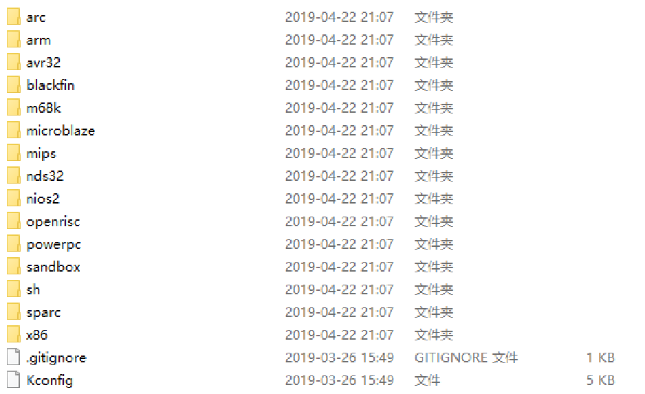
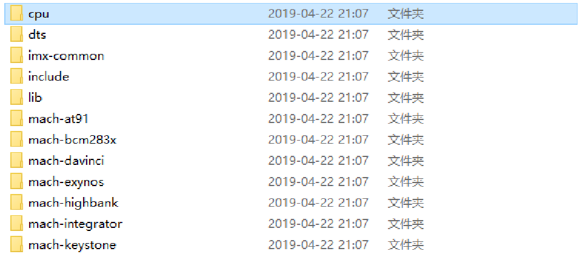
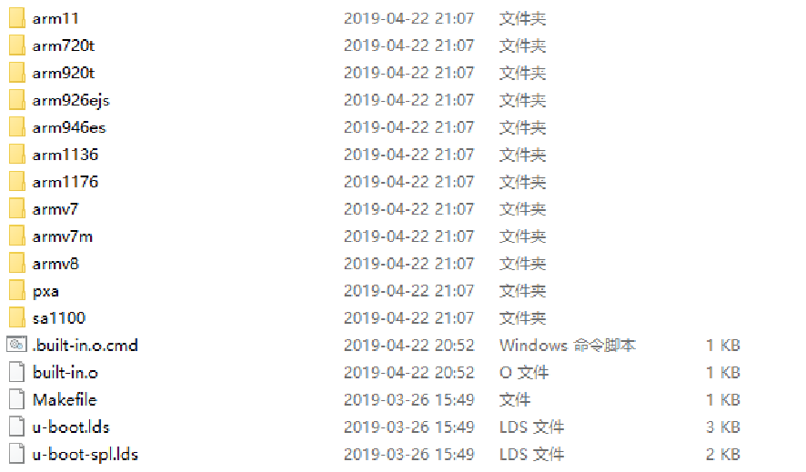
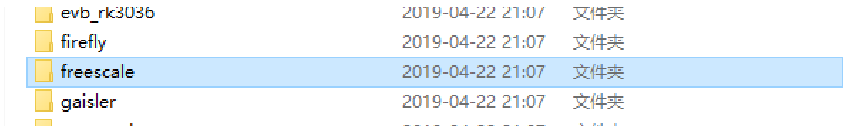
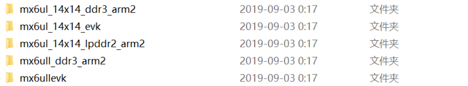
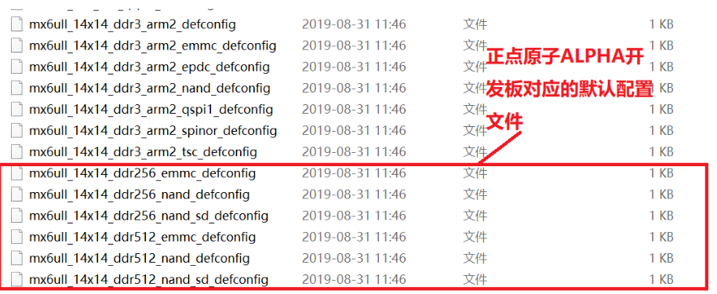

# 1. arch文件夹

arch文件夹包含了与处理器架构相关的代码，主要负责处理器的初始化，异常处理，以及与处理器相关的功能实现，如中断控制，时钟管理等。对于不同的处理器架构，arch文件夹下会有不同的子目录，如arm、x86等，每个子目录对应一个处理器架构。如下图：

对于I.MX6ULL开发板，涉及的芯片是基于ARM Cortex-A架构的，因此我们主要关注arch/arm目录下的代码如下图：

对于arch/arm目录中的文件，我们根据芯片型号选择对应的文件夹，和在arch/arm/cpu目录下的文件夹，来查看与处理器架构相关的文件，如图下：

对于i.MX6ULL开发板，我们需要关注arch/arm/cpu/armv7目录下的文件，这些文件包含了与ARMv7架构相关的代码实现，这些是cpu的运行规则；arch/arm下imx-common目录下的文件，这些文件包含了与i.MX6ULL芯片相关的代码实现，这些是芯片的运行规则，列如时钟管理，ddr初始化等。

# 2. board文件夹

board文件夹包含了与具体开发板相关的代码，主要负责开发板的初始化，外设驱动，以及与开发板相关的功能实现，如串口、网络、存储等。对于不同的开发板，board文件夹下会有不同的子目录，每个子目录对应一个开发板。如下图：

使用freescale芯片的板子都放到此文件夹中,I.MX系列以前属于freescale,只是freescale后来被NXP收购了。打开此freescale文件夹,在里面找到和mx6u(I.MX6UL/ULL)有关的文件夹,如图下：

如果是自己画的板子，比如用的I.MX6UL/ULL芯片，那么久可以在这个文件夹中，可以创建新的文件夹，命名为自己的板子名字，在里面编写与自己板子相关的代码实现。

# 3. configs 文件夹

U-Boot 是可配置的，但从头开始逐一配置每个项目会非常麻烦。因此，半导体或开发板厂商通常会制作好配置文件供使用。我们可以在这些现成的配置文件基础上添加自己想要的功能。
这些由半导体厂商或开发板厂商制作好的配置文件统一命名为 `xxx_defconfig`，其中 `xxx` 表示开发板名字。这些 defconfig 文件都存放在 configs 文件夹中，如下图：


# 4. 其它重要文件说明

本节整理 U-Boot 根目录下常见的生成文件和配置文件，重点说明它们的作用以及相互关系。

## 4.1 `.u-boot.xxx_cmd` 文件

这类文件是编译过程中自动生成的命令记录文件，通常用于保存某个目标文件的生成命令。`make` 会根据这些命令文件判断目标文件是否需要重新生成。

常见示例：

- `.u-boot.bin.cmd`

  记录 `u-boot.bin` 的生成命令：

  ```makefile
  cmd_u-boot.bin := cp u-boot-nodtb.bin u-boot.bin
  ```

  表示将 `u-boot-nodtb.bin` 拷贝并生成 `u-boot.bin`。

- `.u-boot-nodtb.bin.cmd`

  记录 `u-boot-nodtb.bin` 的生成命令：

  ```makefile
  cmd_u-boot-nodtb.bin := arm-linux-gnueabihf-objcopy --gap-fill=0xff ... u-boot u-boot-nodtb.bin
  ```

  表示使用 `objcopy` 工具将 ELF 格式的 `u-boot` 转换为二进制镜像。

- `.u-boot.cmd`

  记录 `u-boot` ELF 文件的链接命令：

  ```makefile
  cmd_u-boot := arm-linux-gnueabihf-ld.bfd ... -o u-boot ...
  ```

  表示通过链接各目录下的 `built-in.o` 等目标文件，生成最终的 `u-boot` ELF 文件。

- `.u-boot.imx.cmd`

  记录 `u-boot.imx` 的生成命令：

  ```makefile
  cmd_u-boot.imx := ./tools/mkimage -n ... -d u-boot.bin u-boot.imx
  ```

  表示使用 `mkimage` 给 `u-boot.bin` 添加 NXP i.MX 平台需要的头部信息，生成 `u-boot.imx`。

这类 `.cmd` 文件一般不需要手动修改，重新编译时会由构建系统自动更新。

## 4.2 `u-boot.xxx` 文件

这些文件一般是编译后生成的镜像、链接信息或调试辅助文件：

| 文件 | 作用 |
| --- | --- |
| `u-boot` | ELF 格式的可执行文件，包含符号信息，常用于调试和反汇编分析。 |
| `u-boot.bin` | 纯二进制格式的 U-Boot 镜像，常用于烧写或进一步打包。 |
| `u-boot.imx` | 在 `u-boot.bin` 基础上添加 NXP i.MX 平台头部信息后的镜像。 |
| `u-boot.lds` | 链接脚本，用于描述代码段、数据段等内容的链接地址和布局。 |
| `u-boot.map` | 映射文件，用于查看函数、变量和各段内容的链接地址。 |
| `u-boot.srec` | S-Record 格式镜像，部分烧写工具或调试工具会使用这种格式。 |
| `u-boot.sym` | 符号表文件，记录函数和变量等符号信息。 |
| `u-boot-nodtb.bin` | 未包含设备树的二进制镜像。 |

## 4.3 `.config` 文件

`.config` 是 U-Boot 的最终配置文件，通常由下面的命令自动生成：

```bash
make xxx_defconfig
```

文件中以 `CONFIG_` 开头的配置项用于控制功能开关，例如：

```makefile
CONFIG_CMD_BOOTM=y
```

Makefile 会根据这些配置项决定是否编译对应模块，例如：

```makefile
obj-$(CONFIG_CMD_BOOTM) += bootm.o
```

当 `CONFIG_CMD_BOOTM=y` 时，`bootm.o` 会被加入编译；如果该配置没有开启，则不会编译这个目标文件。

## 4.4 `Makefile` 文件

顶层 `Makefile` 负责 U-Boot 的整体编译流程，包括读取配置、进入子目录编译、链接目标文件以及生成最终镜像。

各子目录下也会有自己的 `Makefile`，用于管理当前目录中哪些文件需要参与编译。常见写法如下：

```makefile
obj-y += init.o
obj-$(CONFIG_CMD_BOOTM) += bootm.o
```

这种分层管理方式可以让 U-Boot 按模块组织代码，也便于根据配置项裁剪功能。

## 4.5 `README` 文件

`README` 通常用于说明 U-Boot 的编译方法、目录结构、移植注意事项和常用命令。阅读源码时，可以先看 `README`，再结合 `Makefile`、`.config` 和生成的镜像文件理解整个工程的构建流程。

---

通过以上文件，可以大致串起 U-Boot 的生成流程：先由 `defconfig` 生成 `.config`，再由各级 `Makefile` 按配置编译源码，最后生成 `u-boot`、`u-boot.bin`、`u-boot.imx` 等目标文件。

